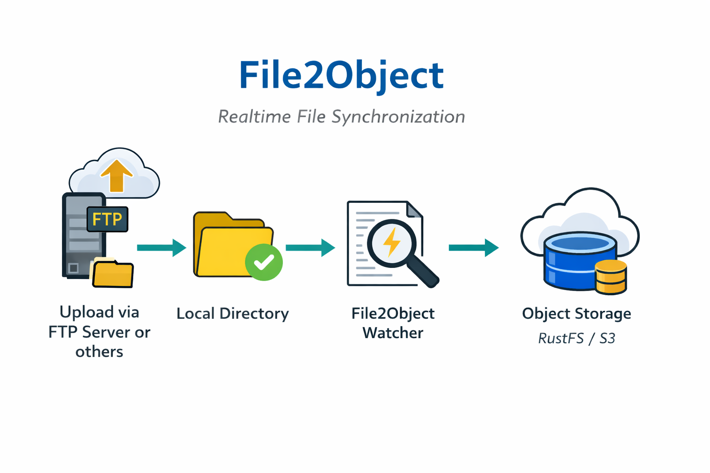
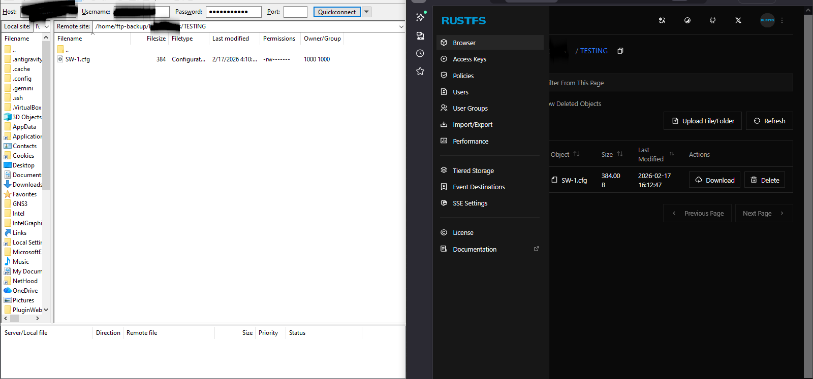
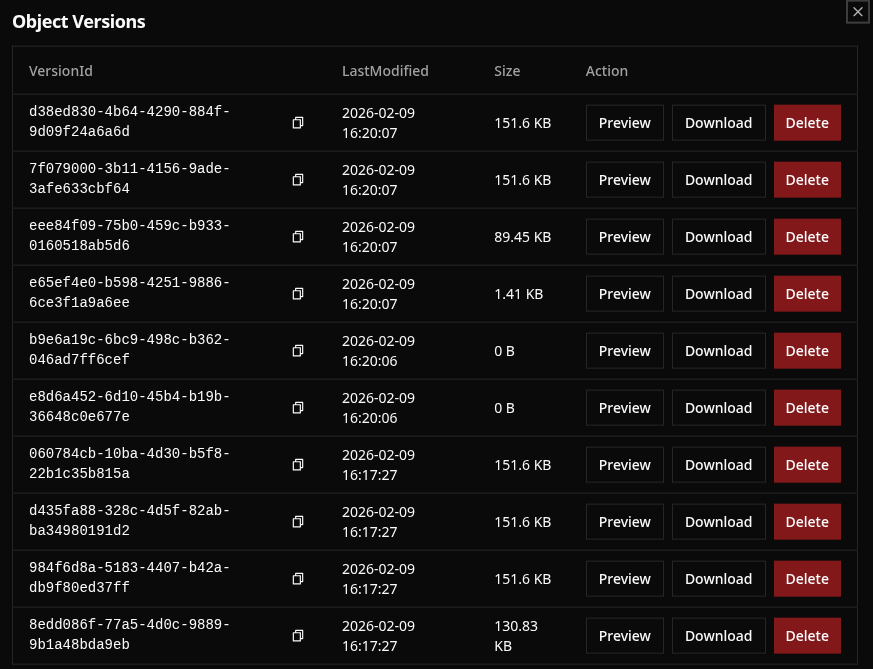

# File2Object

**File2Object** is a lightweight automation service that performs **real-time synchronization from local filesystem directories to S3-compatible object storage** using event-driven triggers.

This project is designed for environments such as:

* ISP / Telco backup device configs
* FTP backup pipelines
* Edge storage replication
* Automated object storage ingestion

File changes are detected instantly using Linux **inotify**, then mirrored to object storage using **MinIO Client (mc)**.

---

# Architecture Overview

```
Upload file via FTP Server or others → Local Directory → File2Object Watcher → Object Storage (RustFS / S3)

```


Workflow:

1. Device uploads backup to FTP server or others
2. File stored in local directory
3. File2Object detects filesystem event
4. Automatic mirror to Object Storage
5. Storage stays synchronized in near real-time

---

# Features

* Real-time file monitoring
* S3 compatible (RustFS, MinIO, AWS S3, Ceph, etc.)
* Automatic sync on create / modify / delete
* One-way mirror with cleanup support
* Lightweight and low resource usage
* Systemd service integration
* Production-ready logging

---

# Requirements

* Linux server (Ubuntu / Debian recommended)
* Root or sudo privileges
* FTP server installed (optional but common use case)
* RustFS / S3 compatible object storage running
* MinIO Client

Packages:

```
inotify-tools
wget
MinIO Client
```

---

# Installation

## 1. Install Dependencies

```bash
apt update
apt install inotify-tools wget -y
```

---

## 2. Install MinIO Client (mc)

Download binary:

```bash
wget https://dl.min.io/client/mc/release/linux-amd64/mc
chmod +x mc
mv mc /usr/local/bin/mcli
```

Verify installation:

```bash
mcli --version
```

---

## 3. Configure Object Storage Connection

Set alias to RustFS (S3 compatible):

```bash
mcli alias set rustfs http://[IP_ADDRESS] ACCESS_KEY SECRET_KEY
```

Test connection:

```bash
mcli ls rustfs
```

Output:

```bash
root@RustFS:~# mcli ls rustfs
[2026-02-09 06:52:43 UTC]     0B backup-files/
```

Create bucket if don't exist:

```bash
mcli mb rustfs/backup-files
```

---

# Configuration

Create watcher script:

```bash
nano /usr/local/bin/file2object.sh
```

Script:

```bash
#!/bin/bash

SOURCE="/home/ftp-backup/backup-files"
TARGET="rustfs/backup-files"
LOG="/var/log/file2object.log"

inotifywait -m -r -e modify,create,delete,move "$SOURCE" |
while read path action file; do
    echo "$(date) - Change detected: $action $path$file" >> $LOG
    /usr/local/bin/mcli mirror --overwrite --remove "$SOURCE" "$TARGET" >> $LOG 2>&1
done
```

Make executable:

```bash
chmod +x /usr/local/bin/file2object.sh
```

---

# Systemd Service

Create service file:

```bash
nano /etc/systemd/system/file2object.service
```

Service configuration:

```ini
[Unit]
Description=File2Object Realtime Sync Service
After=network.target

[Service]
ExecStart=/usr/local/bin/file2object.sh
Restart=always
User=root

[Install]
WantedBy=multi-user.target
```

Enable and start:

```bash
systemctl daemon-reexec
systemctl daemon-reload
systemctl enable --now file2object
```

Check status:

```bash
systemctl status file2object
```

Output:

```bash
root@RustFS:~# systemctl status file2object.service 
```markdown
● file2object.service - File2Object Realtime Sync Service
```
     Loaded: loaded (/etc/systemd/system/file2object.service; enabled; preset: enabled)
     Active: active (running) since Mon 2026-02-09 09:47:26 UTC; 1 week 1 day ago
   Main PID: 233 (file2object.sh)
      Tasks: 3 (limit: 115889)
     Memory: 29.5M (peak: 39.1M)
        CPU: 1.472s
     CGroup: /system.slice/file2object.service
             |-233 /bin/bash /usr/local/bin/file2object.sh
             |-234 inotifywait -m -r -e modify,create,delete,move /home/ftp-backup/backup-files
             `-235 /bin/bash /usr/local/bin/file2object.sh

Feb 09 09:47:26 RustFS systemd[1]: Started file2object.service - File2Object Realtime Sync Service.
Feb 09 09:47:26 RustFS file2object.sh[234]: Setting up watches.  Beware: since -r was given, this may take a while!
Feb 09 09:47:26 RustFS file2object.sh[234]: Watches established.
```

---

# Logging

Logs stored at:

```
/var/log/file2object.log
```

View logs:

```bash
tail -f /var/log/file2object.log
```

---

# Testing

Create test file:

```bash
touch /home/ftp-backup/backup-files/TESTING/SW-1.cfg
ls /home/ftp-backup/backup-files/TESTING
```

Verify object storage:

```bash
mcli ls rustfs/backup-files/TESTING
```

Output:

```bash
root@RustFS:~# ls /home/ftp-backup/backup-files/TESTING
SW-1.cfg
root@RustFS:~# mcli ls rustfs/backup-files/TESTING
[2026-02-17 09:12:47 UTC]   384B STANDARD SW-1.cfg
```



---

# Optional (Recommended)

Enable bucket versioning:

```bash
mcli version enable rustfs/backup-files
```

This protects data from accidental deletion when using `--remove`. So if file is replaced with another file, the old file will be kept as a version.



---

# Use Cases

* Network device configuration archival
* Network infrastructure backup
* FTP to Object Storage bridge
* Edge data replication

---

# Performance Notes

* Suitable for thousands of files
* Minimal CPU usage
* Event-driven (no polling)
* Mirror execution depends on storage latency

For very large datasets consider batching or scheduled sync intervals.

---

## Links

Origin : 
- [Origin](https://github.com/andre4freelance/File2Object)
- [Linkedin post](https://www.linkedin.com/posts/link-andre-bastian_devops-sysadmin-cloudcomputing-activity-7429508697380282368-LO6y?utm_source=share&utm_medium=member_desktop&rcm=ACoAAD73JlUBty-p-mBfMEW0-O4j0sv-e_PRQvc)
- Facebook post